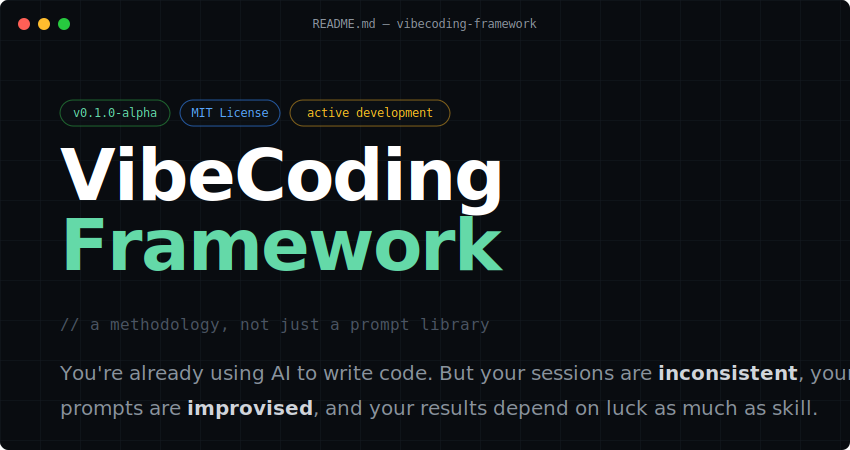
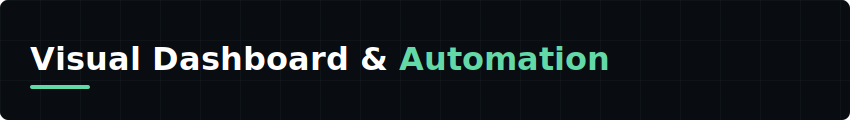
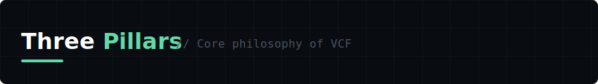

<div align="center">
  
</div>

---

You're already using AI to write code. But your sessions are **inconsistent**, your
prompts are **improvised**, and your results depend on luck as much as skill.

VCF is a structured approach to AI-assisted development — opinionated workflows,
reusable prompt contracts, and session conventions that turn LLMs into reliable
engineering partners.

<br>

VCF is powered by a React (Vite) visual dashboard and a Node.js automation engine connected to Gemini API.

```bash
# 1. Start the Automation Engine (Backend)
cd tools/backend
npm install
npm start

# 2. Start the Vibe Dashboard (Frontend)
cd tools/gui
npm install
npm run dev
# The dashboard will open at http://localhost:5173
```

<br>


| | Pillar | What it gives you |
|---|---|---|
| **01** | **Prompt contracts** | Typed, versioned templates with defined inputs and expected outputs |
| **02** | **Session workflows** | Step-by-step guides for feature, hotfix, refactor, review sessions |
| **03** | **Context hygiene** | Conventions for managing LLM context across long sessions and handoffs |


---

<div align="center">

[Get started](./docs/README.md) · [Browse prompts](./prompts/) · [Contribute](./CONTRIBUTING.md)

</div>
